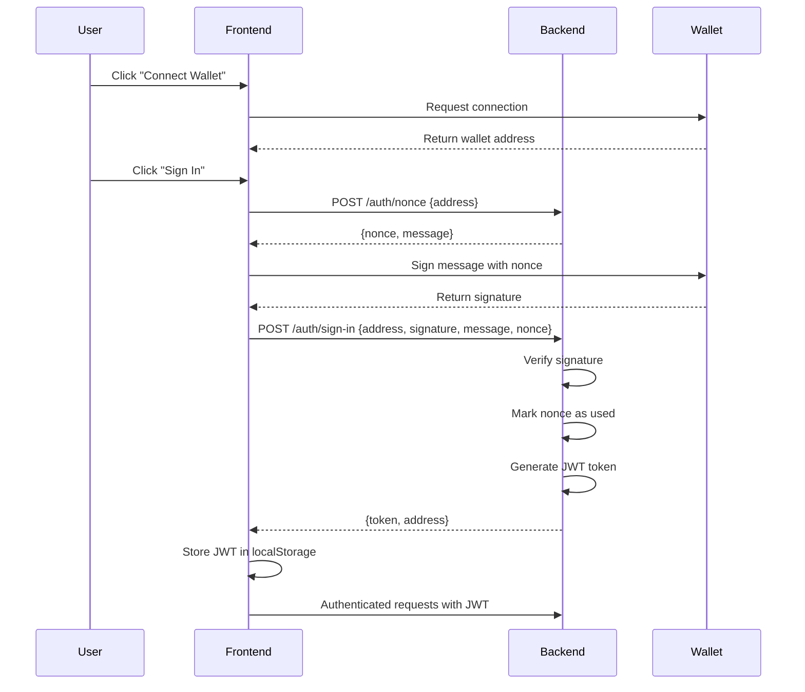

# Release Notes - Wallet Authentication & Challenge Integration

## 🎉 New Features

### 1. Wallet-Based Authentication System

Implemented secure wallet signature authentication using Sui dApp Kit.

#### Authentication Flow



### 2. API Endpoints

#### Public Endpoints (No Authentication Required)

**Get Nonce for Signing**
```http
POST /auth/nonce
Content-Type: application/json

{
  "address": "0x7f67a90d907dc08ba4e411c86494b14386808394a76b9196a783e9c1ee89ba86"
}
```

Response:
```json
{
  "success": true,
  "message": "Nonce generated successfully",
  "data": {
    "nonce": "fbdc2ad8bba6e9ffca9fa07d77815e0a6bc29ec32b2f0138affdda85c7e6d0c7",
    "message": "Sign in to SuiSpeedrun\n\nThis request will not trigger a blockchain transaction or cost any gas fees.\n\nAddress: 0x7f67...\nNonce: fbdc2ad8...\nTimestamp: 1768633923"
  }
}
```

**Sign In with Wallet**
```http
POST /auth/sign-in
Content-Type: application/json

{
  "address": "0x7f67a90d907dc08ba4e411c86494b14386808394a76b9196a783e9c1ee89ba86",
  "signature": "AI8hrG+53n/6uvJ022F5Dao+xJ0uvwE3r/3ahcfm0Mc=",
  "message": "Sign in to SuiSpeedrun...",
  "nonce": "fbdc2ad8bba6e9ffca9fa07d77815e0a6bc29ec32b2f0138affdda85c7e6d0c7"
}
```

Response:
```json
{
  "success": true,
  "message": "Sign in successful",
  "data": {
    "token": "eyJhbGciOiJIUzI1NiIsInR5cCI6IkpXVCJ9...",
    "address": "0x7f67a90d907dc08ba4e411c86494b14386808394a76b9196a783e9c1ee89ba86"
  }
}
```

**List All Challenges**
```http
GET /v1/challenges
```

Response:
```json
{
  "success": true,
  "message": "Challenges retrieved successfully",
  "data": [
    {
      "challenge_id": "1",
      "title": "Hello Sui",
      "description": "Create your first Sui Move module",
      "difficulty": "EASY",
      "xp_reward": 100,
      "image_url": "",
      "required_modules": ["hello_world"]
    }
  ]
}
```

**Get Single Challenge**
```http
GET /v1/challenges/{id}
```

**Get Builder Profile**
```http
GET /builders/{address}
```

#### Protected Endpoints (JWT Required)

**Verify Challenge Completion**
```http
POST /v1/verify-challenge
Authorization: Bearer {jwt_token}
Content-Type: application/json

{
  "user_address": "0x...",
  "package_id": "0x...",
  "tx_digest": "...",
  "challenge_id": "1"
}
```

### 3. Frontend Implementation

#### Setup

**Install Dependencies**
```bash
cd frontend
npm install @mysten/dapp-kit @mysten/sui @tanstack/react-query
```

**Environment Variables** (`.env.local`)
```env
NEXT_PUBLIC_API_URL=https://0exar5ldpd.execute-api.us-east-1.amazonaws.com
NEXT_PUBLIC_SUI_NETWORK=testnet
NEXT_PUBLIC_PLATFORM_VAULT=0x...
```

#### Key Components

**1. Wallet Provider** (`providers/WalletProvider.tsx`)
```typescript
import { SuiClientProvider, WalletProvider } from '@mysten/dapp-kit';
import { QueryClient, QueryClientProvider } from '@tanstack/react-query';
import { getFullnodeUrl } from '@mysten/sui/client';

// Wraps app with Sui wallet context
```

**2. Authentication Hook** (`hooks/useAuth.ts`)
```typescript
export function useAuth() {
  const currentAccount = useCurrentAccount();
  const { mutateAsync: signPersonalMessage } = useSignPersonalMessage();

  const signIn = async () => {
    // 1. Get nonce from backend
    const { nonce, message } = await getNonce(currentAccount.address);
    
    // 2. Sign message with wallet
    const result = await signPersonalMessage({
      message: new TextEncoder().encode(message),
    });
    
    // 3. Convert signature to base64
    const signatureBase64 = typeof result.signature === 'string'
      ? result.signature
      : btoa(String.fromCharCode(...new Uint8Array(result.signature)));
    
    // 4. Submit to backend
    const { token } = await apiSignIn({
      address: currentAccount.address,
      nonce,
      message,
      signature: signatureBase64,
    });
    
    // 5. Store JWT
    setToken(token);
    setIsAuthenticated(true);
  };

  return { isAuthenticated, signIn, signOut };
}
```

**3. API Client** (`lib/api.ts`)
```typescript
// Base fetch wrapper with JWT injection
async function apiFetch<T>(endpoint: string, options: RequestInit = {}): Promise<T> {
  const token = getToken();
  const headers: Record<string, string> = {
    'Content-Type': 'application/json',
    ...(options.headers as Record<string, string>),
  };

  if (token) {
    headers['Authorization'] = `Bearer ${token}`;
  }

  const response = await fetch(`${API_URL}${endpoint}`, {
    ...options,
    headers,
  });

  if (!response.ok) {
    const error: ApiError = await response.json().catch(() => ({
      error: 'Unknown error',
    }));
    throw new Error(error.message || error.error || 'API request failed');
  }

  // Backend returns { success, message, data }, extract data field
  const result = await response.json();
  return result.data !== undefined ? result.data : result;
}

// Type-safe API methods
export async function getChallenges(): Promise<Challenge[]> {
  return apiFetch<Challenge[]>('/v1/challenges');
}
```

**4. React Query Hooks** (`hooks/useApi.ts`)
```typescript
export function useChallenges() {
  return useQuery({
    queryKey: ['challenges'],
    queryFn: getChallenges,
  });
}

export function useVerifyChallenge() {
  return useMutation({
    mutationFn: verifyChallenge,
  });
}
```

**5. Connect Wallet Component** (`components/ConnectWallet.tsx`)
```typescript
export function ConnectWallet() {
  const { isAuthenticated, isAuthenticating, signIn, error } = useAuth();
  const currentAccount = useCurrentAccount();

  // Three states:
  // 1. No wallet connected -> Show ConnectButton
  // 2. Wallet connected but not authenticated -> Show "Sign In" button
  // 3. Authenticated -> Show wallet address with disconnect option

  if (!currentAccount) {
    return <ConnectButton />;
  }

  if (!isAuthenticated) {
    return (
      <button onClick={signIn} disabled={isAuthenticating}>
        {isAuthenticating ? 'Signing In...' : 'Sign In'}
      </button>
    );
  }

  return (
    <div>
      <span>{currentAccount.address.slice(0, 6)}...{currentAccount.address.slice(-4)}</span>
      <button onClick={disconnect}>Disconnect</button>
    </div>
  );
}
```

### 4. Backend Implementation

#### Key Features

✅ **Nonce System**
- Generates cryptographically secure random nonces (32 bytes)
- Stores nonces in DynamoDB with 5-minute expiration
- Prevents replay attacks by marking nonces as "used" after successful authentication
- Validates nonce ownership (address must match)

✅ **Signature Verification**
- Signs a standardized message format
- Verifies signature is base64-encoded
- TODO: Full Sui signature verification (currently accepts any signature for testing)

✅ **JWT Token**
- Generated after successful signature verification
- Contains wallet address in payload
- Used for all subsequent authenticated requests
- Stored in localStorage on frontend

✅ **CORS Configuration**
- Allows requests from `*`, `http://localhost:3000`, `http://localhost:3001`
- Configured in API Gateway Terraform

### 5. Security Considerations

**⚠️ Important Notes:**

1. **Signature Verification**: Current implementation has basic signature verification. For production, implement full Sui signature verification using sui-go-sdk.

2. **Nonce Management**: 
   - Nonces expire after 5 minutes
   - Each nonce can only be used once
   - Prevents replay attacks

3. **JWT Security**:
   - Tokens contain only the wallet address (no sensitive data)
   - Use strong JWT_SECRET in production (set via environment variable)
   - Consider adding token expiration and refresh mechanism

4. **CORS**:
   - Production should use specific allowed origins, not `*`
   - Update `cors_allowed_origins` in `terraform/variables.tf`

### 6. Usage Example

```typescript
// In a component
import { useAuth } from '@/hooks/useAuth';
import { useChallenges, useVerifyChallenge } from '@/hooks/useApi';

function MyChallenges() {
  const { isAuthenticated } = useAuth();
  const { data: challenges, isLoading } = useChallenges();
  const verifyMutation = useVerifyChallenge();

  const handleVerify = async (challengeId: string) => {
    if (!isAuthenticated) {
      alert('Please sign in first');
      return;
    }

    await verifyMutation.mutateAsync({
      user_address: currentAccount.address,
      package_id: '0x...',
      tx_digest: '...',
      challenge_id: challengeId,
    });
  };

  if (isLoading) return <div>Loading...</div>;

  return (
    <div>
      {challenges?.map(challenge => (
        <ChallengeCard
          key={challenge.challenge_id}
          challenge={challenge}
          onVerify={() => handleVerify(challenge.challenge_id)}
        />
      ))}
    </div>
  );
}
```

### 7. Testing

**Manual Testing Flow:**

1. Open http://localhost:3000
2. Click "Connect Wallet" - wallet extension should prompt
3. Approve wallet connection
4. Click "Sign In" - wallet should prompt to sign message
5. After signing, JWT is stored and user is authenticated
6. Navigate to challenges - should load from backend API
7. Submit a challenge - should require authentication

**API Testing:**

```bash
# Get nonce
curl -X POST https://your-api.execute-api.us-east-1.amazonaws.com/auth/nonce \
  -H "Content-Type: application/json" \
  -d '{"address": "0x..."}'

# List challenges
curl https://your-api.execute-api.us-east-1.amazonaws.com/v1/challenges
```

## 🔧 Technical Improvements

1. **API Response Unwrapping**: Frontend automatically extracts `data` field from `{success, message, data}` responses
2. **Base64 Signature Encoding**: Wallet signatures are properly converted to base64 format
3. **React Query Integration**: Efficient data fetching with automatic caching and revalidation
4. **TypeScript Type Safety**: Full type definitions for API requests/responses

## 🐛 Bug Fixes

- ✅ Fixed CORS blocking frontend requests
- ✅ Fixed API response structure mismatch
- ✅ Fixed signature format incompatibility
- ✅ Fixed missing public challenge endpoints

## 📝 Migration Guide

If upgrading from static challenges to backend integration:

1. Update environment variables in `.env.local`
2. Wrap app with `WalletProvider` in `layout.tsx`
3. Replace static challenge imports with `useChallenges()` hook
4. Add `ConnectWallet` component to navbar
5. Restart dev server to apply env variable changes

## 🚀 Deployment

**Backend:**
```bash
cd /path/to/speedrun-sui
make deploy
```

**Frontend:**
```bash
cd frontend
npm run build
# Deploy to Vercel/Netlify with environment variables set
```

## 📚 Documentation

- [Frontend API Spec](./FRONTEND_API.md) - Complete API documentation
- [Backend Requirements](./backend-requirement.md) - Backend architecture
- [Admin Upload Guide](./ADMIN_UPLOAD_GUIDE.md) - Challenge content management

## 🎯 Next Steps

- [ ] Implement full Sui signature verification on backend
- [ ] Add JWT token expiration and refresh mechanism
- [ ] Create challenge detail pages
- [ ] Implement challenge submission UI
- [ ] Add builder profile pages
- [ ] Create leaderboard
- [ ] Add email notifications for challenges
